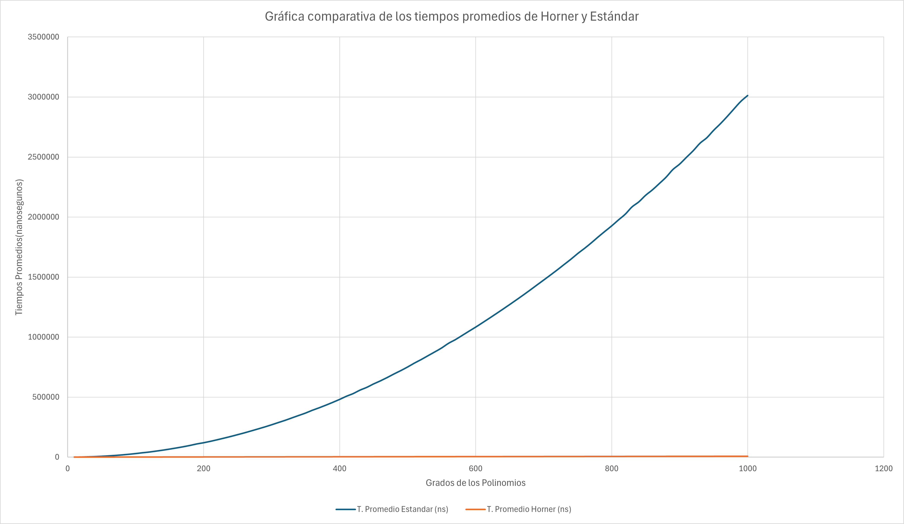

# Eficiencia-Polinomios-Horner
Análisis comparativo de la eficacia de método de evaluación de polinomios

## Evaluación de Tiempos de Polinomios

Este programa tiene como objetivo comparar el tiempo de evaluación de polinomios utilizando dos métodos distintos:

- **evaluación estándar**
- **método de Horner**

El experimento consiste en medir y registrar los tiempos de evaluación promedio de ambos métodos para polinomios de grados desde **10 hasta 1000**, en incrementos de **10**.

**Autor:** María Fernanda Hernández García

---
## Requisitos del sistema para ejecutar el código
 - C++
 - g++


##  Instrucciones de compilación y ejecución:

1. Clonar el repositorio
``` sh
git clone https://github.com/FerHdez08/Eficiencia-Polinomios-Horner.git
```
2. Entrar al directorio del proyecto
```sh
cd Eficiencia-Polinomios-Horner
```
3. Compilar el código 
```sh
g++ "Archivo CPP/Evaluacion-Polinomios.cpp" -o Evaluacion-Polinomios
```
4. Ejecutar código
```sh
Evaluacion-Polinomios

```
*o en su defecto, si no es reconocido, ejecute:*
```bash
   ./Evaluacion-Polinomios
```
<br>

***Alternativa:*** <br>

*Descargar el archivo Evaluacion-Polinomios.cpp y compilar desde un IDE a su preferencia.*

---

## Descripción de los Algoritmos de Evaluación Polinomial

### 1. Método Estándar (Implementado en EvaluarPolinomio())
Evalúa el polinomio como suma de términos independientes:
P(x) = A[0]x^n + A[1]x^[n-1] + ... + A[n-1]x + A[n]

- Calcula cada potencia de x por separado
- Usa multiplicaciones anidadas para potencias
- **Complejidad**: O(n²) operaciones aritméticas

### 2. Método de Horner (Implementado en EvaluarPolinomioHorner())
Evalúa el polinomio como una sucesión, donde multiplicas por el valor de x, le sumas un nuevo coeficiente y al resultado se le vuelve a aplicar lo mismo(multiplicar por el valor de x y sumas el nuevo coeficiente). <br>
Reescribe el polinomio en forma anidada:

P(x) = (...((A[0]x + A[1])x + A[2])x + ... + A[n-1])x + A[n]

- **Complejidad**: O(n) operaciones aritméticas
---
## Resultados experimentales y gráfica comparativa:
  

  Aparentemente el método de Horner pareciera una recta hporizontal , pero eso es solo una prueba más de su eficencia en comparación a la evaluación estándar, teniendo que Horner es lineal, haciéndolo aparentar constante.

## Análisis de Resultados

 - ### Método más veloz:
definitivamente el método de Horner es indiscutiblemente el algoritmo más rapido entre los dos. <br>
 - ### Razón:
esto es debido a que Horner es muy eficaz, ya que no hace cálculos redundantes. A diferencia del método Estandar, que vuelve a calcular cada potencia de x desde el principio. <br>
Claro en el caso donde el polinomio sea con múltiples coeficientes,  Horner tiene una mayor ventaja sobre el método Estándar, en caso de que esto no este sucediendo es que el polinomio evaluado contiene solo un término , por lo que ahí empatarían los métodos ya que coinciden en el número de operaciones. <br> <br>
 - ### Razón de la diferencia de la escala:
en el **método Estándar** la complejidad es **O(n²)**, por lo que al aumentar el grado del polinomio el número aumenta n veces más y como n va en aumento, el tiempo a su vez crece cuadráticamente. <br>
 ```
     for(int j = 1 ; j <= i; ++j){
        term = term*x;
     }
 ```

En este ciclo implementado en el método podemos apreciar como el cálculo para cada potencia de x inicia desde principio siempre. <br> <br>
   
En el **método de Horner** la complejidad es **O(n)**, por lo que el aumento del tiempo es lineal, el grado de n va conforme el tiempo que tarda en evaluar y como esta complejidad es lineal, el tiempo           lo es también. <br>
    
```
    for(int i = 1 ; i <= grado ; ++i){
       valor = valor*x + cof[i];
    }
```
 En este ciclo se puede apreciar como al realizar solo una multiplicación es equivalente a aumentarle la potencia a varios términos del polinomio con solo una operación.

---
 ## Conclusión

Gracias a los resultados experimentales, podemos confirmar la teoría de la complejidad de los métodos, donde pudimos constatar que el método de Horner es superior en cuanto a eficiencia gracias a su poca cantidad en cuanto de operaciones o pasos en comparación a las de la evaluación Estándar. <br>
A pesar de que el procedimiento Estandar para calcular la evaluación de un polinomio parezca más intuitivo, no resulta ser más eficiente, ya que a fin de cuentas el método Estándar realiza varias veces las mismas operaciones.
Entonces para buscar aprovechar la evaluación de un polinomio en menor tiempo de forma significativa podemos optar por utilizar el método de Horner.
